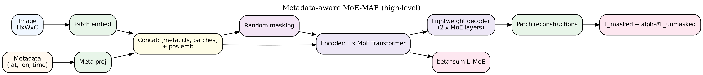

# LightWeight Metadata-Aware Masked AutoEncoder for Earth Observation

This repository contains the implementation of the paper `Lightweight Metadata-Aware Masked Autoencoder for Earth Observation`.

> **Abstract**
>
> Recent advances in Earth Observation have focused on large-scale foundation models. However,
these models are computationally expensive, limiting their accessibility and reuse for downstream
tasks. In this work, we investigate compact architectures as a practical pathway toward smaller
general-purpose EO models. We propose a Metadata-aware Mixture-of-Experts Masked Autoencoder
(MoE-MAE) with only 2.5M parameters. The model combines sparse expert routing with geo-
temporal conditioning, incorporating imagery alongside latitude/longitude and seasonal–daily cyclic
encodings. We pretrain the MoE-MAE on the BigEarthNet-Landsat dataset and evaluate embeddings
from its frozen encoder using linear probes. Despite its small size, the model competes with much
larger architectures, demonstrating that metadata-aware pretraining improves transfer and label
efficiency. To further assess generalization, we evaluate on the EuroSAT-Landsat dataset, which lacks
explicit metadata, and still observe competitive performance compared to models with hundreds
of millions of parameters. These results suggest that compact, metadata-aware MoE-MAEs are
an efficient and scalable step toward future EO foundation models.




## Repository Structure

| Path | Type | Description |
| --- | --- | --- |
| `configs/` | Directory | Training/eval configs for MAE. |
| `configs/train_mae_mmlit.yaml` | File | MAE pretraining configuration. |
| `configs/eval_mae_mmlit.yaml` | File | MAE evaluation configuration. |
| `models/` | Directory | Model implementations. |
| `models/moe_mae.py` | File | MoE-MAE Vision Transformer (PyTorch). |
| `classification_models/` | Directory | Simple classifier models. |
| `classification_models/logistic_regression.py` | File | Logistic regression classifier. |
| `datasets/` | Directory | Dataset loaders. |
| `datasets/bigearthnet.py` | File | BigEarthNet dataset utilities. |
| `datasets/eurosat.py` | File | EuroSAT dataset utilities. |
| `transformation/` | Directory | Data transforms and preprocessing. |
| `transformation/transformer.py` | File | Transformations for model input. |
| `utils/` | Directory | Utilities and helpers. |
| `utils/data_utils.py` | File | Data loading/manipulation helpers. |
| `utils/analysis_utils.py` | File | Analysis and visualization helpers. |
| `utils/data_config.py` | File | Dataset/config helpers. |
| `eval/` | Directory | Evaluation scripts/utilities. |
| `eval/evaluate_mae.py` | File | MAE evaluation routine. |
| `embed/` | Directory | Embedding computation. |
| `embed/compute_embed.py` | File | Generate embeddings from models. |
| `scheduler/` | Directory | Training schedulers. |
| `scheduler/schedulers.py` | File | LR/optimizer scheduler utilities. |
| `pretrain_mae.py` | File | Script to pretrain MAE. |
| `eval_mae.py` | File | Script to evaluate MAE checkpoints. |
| `train_logistic_regression.py` | File | Train LR on computed embeddings. |
| `compute_embeddings_bigearthnet.ipynb` | Notebook | Compute embeddings: BigEarthNet. |
| `compute_embeddings_eurosat.ipynb` | Notebook | Compute embeddings: EuroSAT. |
| `eval_logistic_regression_bigearthnet.ipynb` | Notebook | Evaluate LR: BigEarthNet. |
| `eval_logistic_regression_eurosat.ipynb` | Notebook | Evaluate LR: EuroSAT. |
| `explore_embedding_tsne.ipynb` | Notebook | t-SNE exploration of embeddings. |
| `moe_experiments.ipynb` | Notebook | Experiments with MoE-MAE variants. |
| `sample_dataset/` | Directory | Small sample data and labels. |
| `sample_dataset/samples.csv` | File | Sample index for quick tests. |
| `weights/` | Directory | Saved model weights and artifacts. |

## Model Weights

| Path | Type | Task/Dataset | Format | Description |
| --- | --- | --- | --- | --- |
| `weights/moe_mae_bigearthnet_ls/pretrained_S_best.pth` | Checkpoint | MoE‑MAE | PyTorch `.pth` | Pretrained MoE‑MAE weights (used for embedding/eval). |
| `weights/logistic_regression_bigearthnet_ls/` | Folder | BigEarthNet linear probe | `.joblib` + `.json` | Logistic Regression classifiers trained on BigEarthNet embeddings. |
| `weights/logistic_regression_eurosat_ls/` | Folder | EuroSAT linear probe | `.joblib` + `.json` | Logistic Regression classifiers trained on EuroSAT embeddings. |

## How to run scripts

### Pretrain MoE‑MAE

```powershell
python pretrain_mae.py --config_yaml configs/pretrain_moe_mae.yaml
```

### Resume pretraining from last checkpoint

```powershell
python pretrain_mae.py --config_yaml configs/pretrain_moe_mae.yaml --resume
```

### Evaluate MAE reconstruction

```powershell
python eval_mae.py --config_yaml configs/eval_moe_mae.yaml
```

### Train classifier (BigEarthNet, multilabel)

```powersehll
python train_logistic_regression.py \
  --train /path/to/bigearthnet_train.npz \
  --val /path/to/bigearthnet_val.npz \
  --out weights/logistic_regression_bigearthnet_ls \
  --name logistic_regression_bigearthnet \
  --multilabel true \
  --n-jobs 8
```

### Train classifier (EuroSAT, multiclass)

```powershell
python train_logistic_regression.py \
  --train /path/to/eurosat_train.npz \
  --val /path/to/eurosat_val.npz \
  --out weights/logistic_regression_eurosat_ls \
  --name logistic_regression_eurosat \
  --multilabel false \
  --n-jobs 8
```
